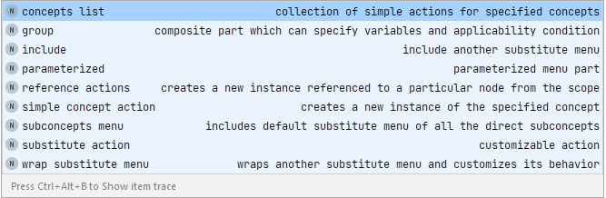

# Substitute menu in MPS

## Options

1. concepts list - add a collection of simple actions for specified concepts
2. group - add a composite part which can specify variables, if a condition is met
3. include - include another substitute menu
4. parameterized - add a parametrised substitute action
5. reference actions -  include and customise the appearance of the possible targets of a reference
6. simple concept action - create a new instance of the specified concept
7. subconcepts menu - include all subconcepts of the concept
8. substitute action - add a single customisable substitute action
9. wrap substitute menu - wrap a specified concept in another substitute menu, using the provided handler to customise its behaviour

##subst1: concepts list
Add a collection of simple actions for specified concepts

##subst2: group
Add a composite part which can specify variables, if a condition is met

##subst3: include
Include another substitute menu

##subst4: parameterized
Add a parametrised substitute action

##subst5: reference actions
Include and customise the appearance of the possible targets of a reference

##subst6: simple concept action
Create a new instance of the specified concept

##subst7: subconcepts menu
Include all subconcepts of the concept

##subst8: substitute action
Add a single customisable substitute action

##subst9: wrap substitute menu
Wrap a specified concept in another substitute menu, using the provided handler to customise its behaviour.

In [Kolja's Heavy Meta video 3: Basic Editors](https://heavymeta.tv/), code [https://github.com/coolya/basic-lang/tree/episode/3](https://github.com/coolya/basic-lang/tree/episode/3) there are 2 examples of a wrap substitute menu:
* when typing an Expression in an ExpressionStatement, the Expression should be part of (= wrapped in) the ExpressionStatement: make a substitute menu for an ExpressionStatement and wrap a substitution menu for an Expression in it.
* when typing a number in an Expression, the NumberLiteral should be part of (= wrapped in) the Expression: make a substitute menu for an Expression and wrap a substitute menu for a NumberLiteral in it.

