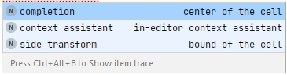
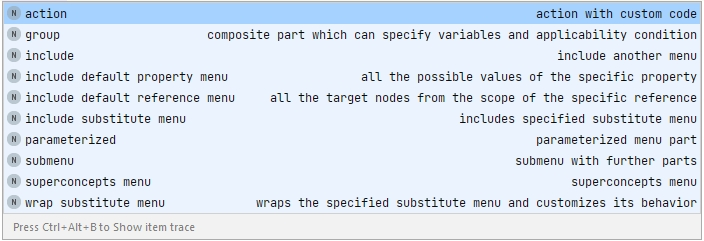

# Transformation menu in MPS

## Locations

## Options

The following standard menu parts are available:

1. action – a simple menu item specifying an action to be performed, its corresponding menu text and applicability.
2. group - a collection of menu items. Beyond these items a group may define one or more variables that are then shared by all actions within the group to avoid repetitive computation. Additionally, a group holds a condition that indicates when the actions in the group should be made available to the user.
3. include- include a specific default or named transformation menu (together with its contributions, if any). Inclusion cycles are detected at runtime and an error message is produced.
4. include default property menu - all the possible values of the specified property
5. include default reference menu - all the target nodes from the scope of the specific reference
6. include substitute menu - include a default or named substitute menu to use as part of this menu.
7. parametrized - an action that is parametrized with multiple values.
8. submenu – a submenu containing further parts.
9. superconcepts menu – includes the default menus of the superconcepts of the applicable concept since these are not included by default.
10. wrap substitute menu - wraps a specified concept using the provided handler

Language jetbrains.mps.lang.editor.menus.extras contains adapters to include various action-like entities from transformation menus:

11. intention – wraps an intention (a subconcept of BaseIntentionDeclaration from jetbrains.mps.lang.intentions).
12. refactoring – wraps a refactoring Refactoring from jetbrains.mps.lang.refactoring.
13. plugin Action – wraps a plugin action ActionDeclaration from jetbrains.mps.lang.plugin.

## transf01: action 
A simple menu item specifying an action to be performed, its corresponding menu text and applicability.

Example side-transform -> action in [Václav's video on transformation menu language](https://www.youtube.com/watch?v=mK40e7bde_Y). Code in Kaja Robot Language example: append a "not" in front of a LogicalExpression.

Other examples in same video (code also in Kaja Robot Language example) with this same single action transformation in side transformation: 
* changing "while" to "if". Using node factories
* "else" after "if". Using a named transformationmenu instead of a default one.

In [Kolja's Heavy Meta video 3: Basic Editors](https://heavymeta.tv/) there is an example right transformation for "+", added to the right of a NumberLiteral. Code [https://github.com/coolya/basic-lang/tree/episode/3](https://github.com/coolya/basic-lang/tree/episode/3).

## transf02: group
A collection of menu items. Beyond these items a group may define one or more variables that are then shared by all actions within the group to avoid repetitive computation. Additionally, a group holds a condition that indicates when the actions in the group should be made available to the user.

        tip

        The variables are calculated eagerly before the condition of the containing group is evaluated. This makes the variables available inside the condition. On the other hand, that means that the computation of the variable initial values is performed irrespective of the result of the condition.

        If you want to protect variable computation with a condition, simply wrap the group in another group. The outer group's condition will protect the inner group's variables from unnecessary computation.

## tranf03: include
Include a specific default or named transformation menu (together with its contributions, if any). Inclusion cycles are detected at runtime and an error message is produced.

Example side-transform -> include at end of [Václav's video on transformation menu language](https://www.youtube.com/watch?v=mK40e7bde_Y). Code in Kaja Robot Language example: the side transformation to add "and" or "or" to a logical expression also has to be done at the right side of a Direction (whose parent is a LogicalExpression). It is done by including the transformation menu for the parent if the parent of that Direction is a LogicalExpression.

## transf04: include default property menu
All the possible values of the specified property

## transf05: include default reference menu
All the target nodes from the scope of the specific reference

## transf06: include substitute menu
Include a default or named substitute menu to use as part of this menu.

## transf07: parametrized
An action that is parametrized with multiple values.

Example side-transform -> parametrized action in [Václav's video on transformation menu language](https://www.youtube.com/watch?v=mK40e7bde_Y). Code in Kaja Robot Language example: append a "and" or "or" right or left of a LogicalExpression. Contribution transformation to the used KajaAndOr-language.

## transf08: submenu
A submenu containing further parts.

## transf09: superconcepts menu
Includes the default menus of the superconcepts of the applicable concept since these are not included by default.

## transf10: wrap substitute menu
Wraps a specified concept using the provided handler

